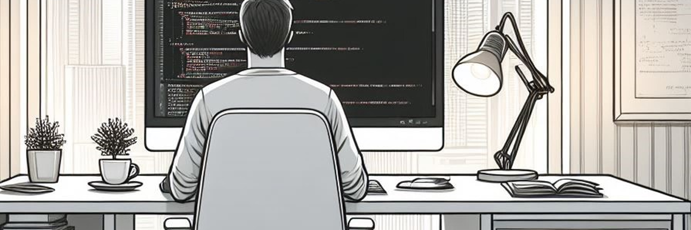

<!-- Header section -->
<h1 align="center">José Ríos</h1>

<h3 align="center">Hello there! 👋</h3>

    

<!-- About me, section -->
<h2>🐻 About me</h2>

    Just a normal software developer with a focus on web applications and QA testing. Dedicated to continuous learning and enhancing proficiency with the latest technologies. Seeking to contribute technical expertise to a dynamic development team.

    Passionate about: learn useful things, read, music, play drums, draw, carpentry, railroad scale models, and history about the explore space careers.

<h2>🔭 Personal current projects</h2>

    
    

<h2>🌱 I'm currently learning</h2>

    I've always enjoyed continuously learning and staying informed in the field of software development technologies. The dynamic and ever-evolving nature of software development challenges me every day to be a more efficient and knowledgeable software developer.

    

<h2>🚀 Technical Skills</h2>

    Usually, these are the technologies I have worked with the most throughout my professional career, and they are also the ones I enjoy using the most. My experience has been primarily focused on handling and implementing these technologies, allowing me to develop a solid understanding and practical skills

    

